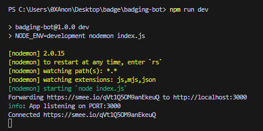
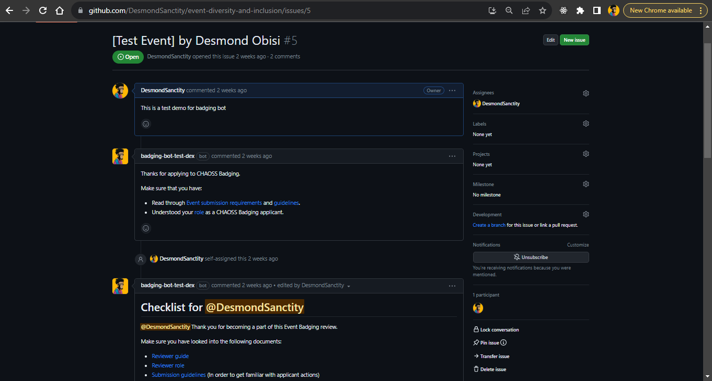
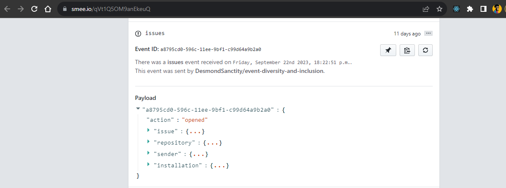

# Tutorial

This tutorial aims to guide you through the process of setting up the bot on your local development environment in case you are using an operating system not currently supported by the bot script. If you have a linux environment and would rather use the bot script, follow the guide in the [README.md](README.md) document instead.

## Tools needed

- Node & NPM
- A GitHub account
- A [smee.io](https://smee.io/) webhook URL (to get this, head over to the website and click on 'Start a new channel'. A unique webhook url will be displayed. Save this for later).

## Steps

### 1. Fork the Badging Bot repository


Fork this repository by clicking on the fork button on the top of this page. This will create a copy of this repository in your account.

### 2. Fork the Event Diversity and Inclusion repository


Fork the event-diversity-and-inclusion [repository](https://github.com/badging/event-diversity-and-inclusion) by clicking on the fork button on the repository page. This is where the GitHub app will be installed to test the bot.

### 3. Clone the Badging Bot repository
Clone the forked repository to your machine by opening the forked repository, click on the 'code' button and then click the _copy to clipboard_ icon.

Open a terminal on your local computer and run the following git command:

```
git clone "url you just copied"

```

## Create a branch

Change to the repository directory on your computer (if you are not already there):

```
cd badging-bot

```

Now create a branch using the `git switch` command:

```
git switch -c your-new-branch-name
```

For example:

```
git switch -c add-my-bot-contributions

```

## Create a .env file
Create a .env file following the example_env file provided in the folder. This will be used to store all the credentials needed for the bot to run.

## Generate credentials
To generate your own credentials, you need to create your own GitHub App and configure it to run on the event-diversity-and-inclusion repository. To do this, follow this steps:

1. Head over to your Github account.

2. Go to 'Settings'. 


3. Scroll down and click on 'Developer Settings'


4. Then, click on 'New GitHub App'. 


This will take you to the page where you carry out authentication. Afterwards,, you will be taken to the setup page for the GitHub App where you imput some details.

6. Enter your desired name for the app.

7. For the homepage url, input the url displayed when you started a new Smee channel on SMee.io.


8. Do the same for the webhook url.

9. Input your desired string combination as webhook secret.

10. Under 'Permissions', click on the drop down arrow for 'Repository permissions'. Grant read and write access to environments, issues, pages and webhooks.


11. Under 'Subscribe to events', check 'Issues' and 'issue-comments'.


12. Under where can the GitHub App be installed', select 'Only on ths account'.


13. Then click on 'Create Github App'. You will be redirected to the page displaying your app's settings where you can fetch your credentials---AppId, ClientId, and Client secret and private key.

14. To access the private key, scroll down the page and click on the 'Generate private key' button to download a private key file (usually in the PEM format). Save this file in a secure location, as it will be required for authenticating and interacting with your GitHub app.


15. At the top left section of the page, click on the 'Install App' button. You will be redirected to this page.


16. Check 'Only select repositories'.


17. Search and select the diversity-and-inclusion-event repository that you forked earlier.

18. Click on Install.


Now you will be able to test and use the app's functionalities on the DEI badging for events repository.

19. Head over to your .env file and input all the credentials generated. It should look like this:
```js
appId=xxxxx
privateKey=xxxxx
clientId=xxxxx
clientSecret=xxxxx
webhookSecret=xxxxx
PORT=xxxxx
smee_URL=xxxxx
```
20. Start the app on the development envrionment using the command below:
```js
npm run dev
```
This will start the app on the development environment and connect to smee.io webhook URL.


21. To test, head over to the event-diversity-and-inclusion repository and create a new issue. You will see that the bot has added a comment to the issue. When the issue is assigned to anyone,the bot will send the checklist for the event and so on.


22. You can also see the webhook events on the smee.io page using the URL provided in the .env file.


23. To start adding more functionalities or improving existing ones, the core functions are written in the src directory. You can see few examples like `assignChecklist.js`, `welcome.js`, `issueComment.js`, `checkModerator.js` etc where the bot comands and logic are written.

24. To add a new functionality/feature you created to the flow such that either a command or a condition met triggers the feature, you will extend the function in the `githubBot.js` file. There you can state the condition or event that triggers any feature and the function that will be triggered.

25. Make sure to follow the code style, naming convention and formating guidelines as it will help the code to be readable and understandable. You can find the contributing guidelines [here](https://github.com/badging/badging-bot/blob/main/CONTRIBUTING.md).